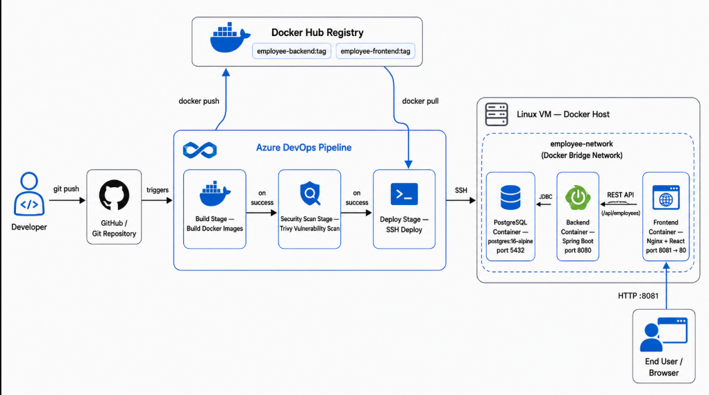

# Azure DevOps End-to-End CI/CD Project using Docker

**A full-stack Employee Directory app (React + Spring Boot + PostgreSQL), containerized with Docker and deployed through a complete, production-style Azure DevOps CI/CD pipeline — from git push to a running app on a Linux VM.**

I built this to practice a real end-to-end DevOps workflow rather than just a toy deployment: writing multi-stage Dockerfiles, wiring up a multi-stage Azure DevOps pipeline (build → security scan → deploy), gating deployment on branch and scan results, and shipping to a VM over SSH with proper Docker networking between services.

The application itself (Employee Directory) is intentionally simple — the point of this project is the **pipeline and deployment engineering** around it, not the app's feature set.

---

## Tech Stack

| Layer | Technology |
|---|---|
| Frontend | React 18, Vite, Bootstrap 5, Axios, served via Nginx |
| Backend | Java 21, Spring Boot 3.2.3, Spring Data JPA, Spring Web, Lombok |
| Database | PostgreSQL 16 (Alpine) |
| Containerization | Docker (multi-stage builds) |
| CI/CD | Azure DevOps Pipelines (YAML) |
| Security Scanning | Trivy (image vulnerability scanning) |
| Deployment Target | Linux VM (Docker Engine, SSH-based deployment) |

**Project type:** Personal / portfolio project — built solo to demonstrate an end-to-end CI/CD workflow on Azure DevOps.

---

## Architecture



All three containers (`postgres`, `backend`, `frontend`) run on a shared user-defined Docker bridge network (`employee-network`) so the backend can reach Postgres by container name (`postgres`), and the frontend can reach the backend by container name (`backend`).

---

## Folder Structure

```text
employee-directory/
├── backend/
│   ├── src/
│   │   └── main/
│   │       ├── java/com/example/employeedirectory/
│   │       │   ├── config/WebConfig.java
│   │       │   ├── controller/EmployeeController.java
│   │       │   ├── model/Employee.java
│   │       │   ├── repository/EmployeeRepository.java
│   │       │   ├── service/
│   │       │   │   ├── EmployeeService.java
│   │       │   │   └── EmployeeServiceImpl.java
│   │       │   └── EmployeeDirectoryApplication.java
│   │       └── resources/application.properties
│   ├── pom.xml
│   └── Dockerfile
├── frontend/
│   ├── src/
│   │   ├── components/
│   │   │   ├── AddEmployeeModal.jsx
│   │   │   ├── EmployeeList.jsx
│   │   │   └── Navbar.jsx
│   │   ├── services/employeeService.js
│   │   ├── App.jsx
│   │   ├── index.css
│   │   └── main.jsx
│   ├── index.html
│   ├── nginx.conf
│   ├── package.json
│   ├── vite.config.js
│   └── Dockerfile
├── azure-pipelines.yml
└── README.md
```

---

## REST API Endpoints

| Method | Endpoint | Description |
|---|---|---|
| `GET` | `/api/employees` | Retrieve all employees |
| `POST` | `/api/employees` | Add a new employee |
| `DELETE` | `/api/employees/{id}` | Delete an employee by ID |

---

## CI/CD Pipeline (Azure DevOps)

The pipeline (`azure-pipelines.yml`) is triggered on pushes to `main` and `feature/*` branches (scoped to changes under `backend/`, `frontend/`, or the pipeline file itself), and runs on the `rike-agent-pool` agent pool. It has three stages:

### 1. `BuildDockerStage`
Builds and pushes both Docker images to Docker Hub using the `svc-docker` service connection:
- `rishikejriwal/employee-backend:$(Build.BuildId)`
- `rishikejriwal/employee-frontend:$(Build.BuildId)`

Each image is tagged with the pipeline's `Build.BuildId` so every run produces a uniquely traceable image.

### 2. `SecurityScanStage`
Runs **Trivy** vulnerability scans against both freshly built images before they're allowed to deploy — catching known CVEs in OS packages and dependencies early.

### 3. `deploy`
Only runs if `BuildDockerStage` and `SecurityScanStage` both succeed **and** the branch is `main`. Connects to the target VM over SSH (`ssh-vm` endpoint) and:
1. Installs Docker on the VM if it isn't already present, and ensures the Docker service is enabled/running.
2. Creates the `employee-network` Docker bridge network if it doesn't already exist.
3. Pulls the latest `postgres:16-alpine`, backend, and frontend images.
4. Stops/removes any existing containers, then runs fresh containers for Postgres, backend, and frontend on `employee-network`.

Database credentials and Spring datasource config are pulled from the `employee-app-vars` variable group and injected as environment variables at container runtime — nothing sensitive is hardcoded in the pipeline.

---

## Environment Variables

Set these in the Azure DevOps **variable group** `employee-app-vars` (mark secrets as secret variables):

| Variable | Used By | Description |
|---|---|---|
| `POSTGRES_DB` | Postgres container | Database name |
| `POSTGRES_USER` | Postgres container | Database user |
| `POSTGRES_PASSWORD` | Postgres container | Database password (secret) |
| `SPRING_DATASOURCE_URL` | Backend container | JDBC URL, e.g. `jdbc:postgresql://postgres:5432/<db_name>` |
| `SPRING_DATASOURCE_USERNAME` | Backend container | Should match `POSTGRES_USER` |
| `SPRING_DATASOURCE_PASSWORD` | Backend container | Should match `POSTGRES_PASSWORD` (secret) |

---

## Data Persistence — Docker Volumes

The PostgreSQL container is backed by a **named Docker volume** (`postgres_data`), not the container's writable layer:

```bash
-v postgres_data:/var/lib/postgresql/data
```

This matters because containers are meant to be disposable — every deploy in the pipeline stops and removes the old `employee-postgres` container and starts a fresh one from the `postgres:16-alpine` image. Without a volume, that would wipe the database on every single deployment.

By mounting `postgres_data` at Postgres's data directory, the actual database files live outside the container's lifecycle, on the Docker host. So:

- Restarting, stopping, or even completely removing and recreating the `employee-postgres` container **does not delete any data**.
- The volume persists independently on the VM and is simply re-attached the next time a Postgres container is started with the same volume name.
- This is what makes it safe for the deploy stage to always do a clean stop → remove → run cycle on every pipeline run, instead of trying to preserve the existing container.

You can verify the volume exists and inspect its data independent of any running container with:

```bash
docker volume ls
docker volume inspect postgres_data
```

---

## Running Locally (without the pipeline)

You'll need Docker installed. From the project root:

```bash
# 1. Create a shared network
docker network create employee-network

# 2. Run PostgreSQL
docker run -d \
  --name employee-postgres \
  --network employee-network \
  --network-alias postgres \
  -p 5432:5432 \
  -e POSTGRES_DB=employeedb \
  -e POSTGRES_USER=postgres \
  -e POSTGRES_PASSWORD=postgres \
  -v postgres_data:/var/lib/postgresql/data \
  postgres:16-alpine

# 3. Build and run the backend
cd backend
docker build -t employee-backend .
docker run -d \
  --name employee-backend \
  --network employee-network \
  --network-alias backend \
  -p 8080:8080 \
  -e SPRING_DATASOURCE_URL=jdbc:postgresql://postgres:5432/employeedb \
  -e SPRING_DATASOURCE_USERNAME=postgres \
  -e SPRING_DATASOURCE_PASSWORD=postgres \
  employee-backend

# 4. Build and run the frontend
cd ../frontend
docker build -t employee-frontend .
docker run -d \
  --name employee-frontend \
  --network employee-network \
  -p 8081:80 \
  employee-frontend
```

Then open **http://localhost:8081** in your browser. The frontend talks to the backend at `http://localhost:8080/api/employees`.

---

## Deployment (Production Flow)

1. Push code to `main` (or open a PR from a `feature/*` branch).
2. Azure DevOps pipeline triggers automatically.
3. Docker images are built and pushed to Docker Hub.
4. Trivy scans both images for vulnerabilities.
5. On success, the pipeline SSHes into the target VM and redeploys all three containers (Postgres, backend, frontend) on `employee-network`.
6. The app is reachable at `http://<vm-public-ip>:8081`.

---

## What I Learned / Practiced

- Writing multi-stage Dockerfiles to keep runtime images small (Node build stage → Nginx runtime for frontend; Maven build stage → JRE runtime for backend).
- Structuring a multi-stage Azure DevOps YAML pipeline with stage dependencies and branch-gated deployment conditions.
- Integrating Trivy image scanning as a quality gate before deployment.
- Deploying containers to a remote VM over SSH, including idempotent scripting (checking if a network/container already exists before creating it).
- Using a Docker bridge network and `--network-alias` so containers can resolve each other by service name instead of hardcoded IPs.
- Using a named Docker volume for PostgreSQL so database data survives container restarts and redeployments, instead of living inside the disposable container layer.

---

## Author

**Rishi Kejriwal**
DevOps / Cloud Engineer | Azure • Terraform • Docker • CI/CD
